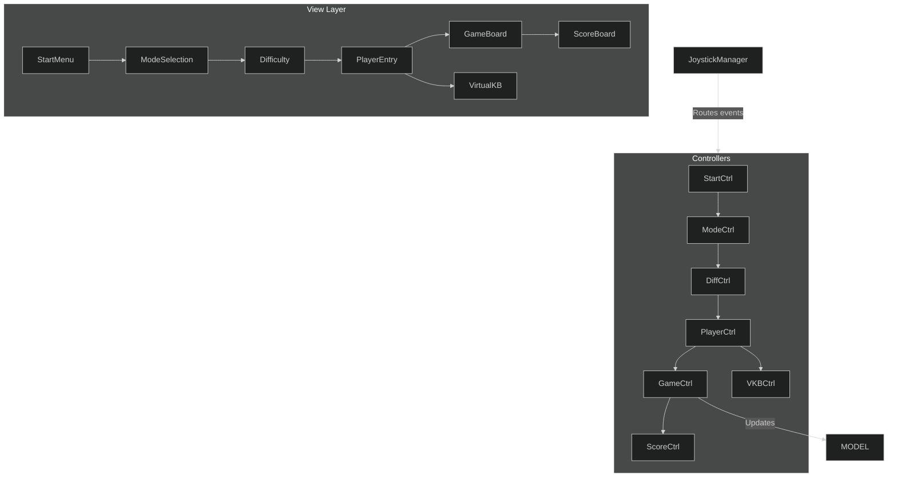
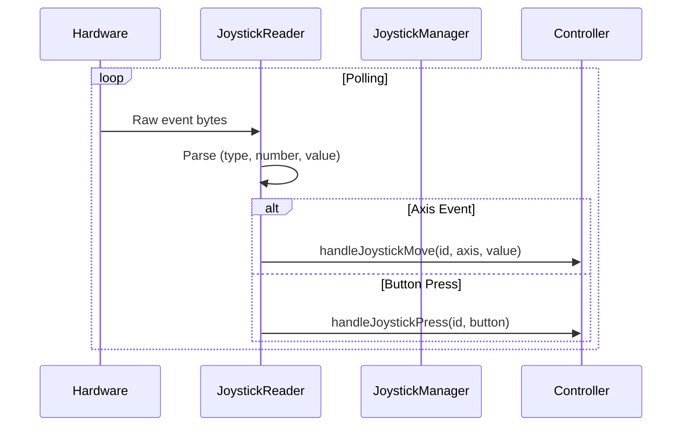

# TicTacToe Game with Joystick Support


## 🎮 Project Overview
A JavaFX implementation of Tic-Tac-Toe featuring **joystick hardware integration** and AI opponents with multiple difficulty levels. Combines classic gameplay with modern technical implementation.

## ✨ Key Features

### 🖥️ Software Architecture
- **MVC Pattern** implementation:
  - **Model**: Game state and AI logic (`GameLogic.java`)
  - **View**: FXML-defined UI screens
  - **Controller**: Mediates view-model interaction
- **Joystick Subsystem**:
  - Direct Linux device file access (`/dev/input/js*`)
  - Hotplug detection with visual alerts
  - Event routing to active controllers

### 🎨 UI Components
| Screen | Purpose | Key Features |
|--------|---------|--------------|
| **Start Menu** | Game entry | Play/exit options, settings |
| **Mode Selection** | Game type | PvP vs PvC selection |
| **Difficulty Selection** | AI configuration | Easy/Medium/Hard levels |
| **Player Setup** | Player configuration | Name entry with virtual keyboard |
| **Game Board** | Core gameplay | Interactive 3x3 grid with joystick support |
| **Score Board** | Results display | Winner announcement, rematch option |

### 🤖 AI Implementation
- **Minimax algorithm** with adaptive difficulty:
  - **Easy**: Random valid moves
  - **Medium**: Strategic moves with occasional mistakes
  - **Hard**: Perfect minimax implementation

### 🕹️ Joystick Integration
```java
public interface JoystickControllable {
    void handleJoystickMove(int joystickId, int axis, int value);
    void handleJoystickPress(int joystickId, int button);
    boolean requiresSecondJoystick();
}
```

Features:

    Multi-joystick support

    Connection/disconnection alerts

    Focus-aware event routing

🛠️ Technical Stack

    Java 17 with JavaFX

    Linux input subsystem (evdev interface)

    Gradle build system

    Mermaid.js for documentation diagrams

🚀 Getting Started
Prerequisites

    Linux OS (joystick support requires direct device access)

    Java 17 JDK

    Gradle 7+

Installation
``` bash
git clone https://github.com/your-repo/TicToeTacGame.git
cd TicToeTacGame
gradle run
```

Joystick Configuration

    Connect game controller(s)

    Verify device permissions:
    bash
    Copy

    sudo chmod a+rw /dev/input/js*

    Launch game - automatic detection enabled

📜 System Architecture
Software Structure

Hardware Sequence

👥 Contributors

    Yasmeen Yasser - UI/UX Design

    Patrick Atef - Game Logic & AI

    Abdallah Salah - Hardware Integration

🔜 Roadmap

    Network multiplayer support

    Advanced AI personalities

    Joystick calibration utility

    Tournament mode with score tracking

    Windows joystick support


