# TicTacToe Game with Joystick Support


## 🎮 Project Overview
A modern JavaFX implementation of Tic-Tac-Toe featuring **joystick hardware integration** and AI opponents with multiple difficulty levels. Designed for both casual play and technical demonstration of Java hardware interfacing.

## ✨ Key Features

### 🖥️ Software Architecture
- **MVC Pattern** with clean separation of:
  - **Model**: `GameLogic.java` handles game state and AI
  - **View**: FXML files for all UI screens
  - **Controller**: Dedicated controllers for each view
- **Joystick API**:
  - Real-time device polling (`/dev/input/js*`)
  - Hotplug detection
  - Event routing to active controllers

### 🎨 UI Components
| Screen | Description |
|--------|-------------|
| **Start Menu** | Game entry point with play/exit options |
| **Mode Selection** | PvP (local) vs PvC (AI) selection |
| **Difficulty Selection** | Easy/Medium/Hard AI levels |
| **Player Setup** | Name entry with virtual keyboard |
| **Game Board** | Interactive 3x3 grid with joystick support |
| **Score Board** | Results display with rematch option |

### 🤖 AI Implementation
- **Minimax algorithm** with difficulty modifiers:
  - Easy: Random moves
  - Medium: Basic strategy
  - Hard: Unbeatable AI

### 🕹️ Joystick Integration
```java
public interface JoystickControllable {
    void handleJoystickMove(int joystickId, int axis, int value);
    void handleJoystickPress(int joystickId, int button);
    boolean requiresSecondJoystick();
}
```

   * Supports multiple joysticks

   * Visual feedback for device connection/disconnection

🛠️ Technical Stack

    Java 17 with JavaFX

    Linux input subsystem (/dev/input/js*)

    Gradle build system

🚀 Getting Started
Prerequisites

    Linux OS (for joystick support)

    Java 17 JDK

    Gradle 7+

Installation
``` bash

git clone https://github.com/your-repo/TicToeTacGame.git
cd TicToeTacGame
gradle run
```

Joystick Setup

    Connect your gamepad/joystick

    Ensure proper permissions for /dev/input/js*

    Launch the game - automatic detection enabled

📜 Game Flow


📜 Software Arch


📜 Hardware sequence diagram

```mermaid

%%{init: {
  'theme': 'dark',
  'fontFamily': 'Comic Sans MS',
  'themeVariables': {
    'primaryColor': '#2B0B33',
    'nodeBorder': '#8E44AD',
    'clusterBkg': '#1e1e3d'
  }
}}%%

sequenceDiagram
    participant Hardware as 🎮 Hardware (js0/js1)
    participant JoystickReader as JoystickReader
    participant JoystickManager as JoystickManager
    participant ActiveController as Active Controller
    participant UI as Current UI

    Note over Hardware,UI: Initialization Phase
    App->>JoystickManager: startHotplugDetection(controller)
    JoystickManager->>Hardware: Check /dev/input/js0, js1
    Hardware-->>JoystickManager: Connection status
    JoystickManager->>JoystickReader: Initialize (if connected)
    JoystickReader->>Hardware: Open input stream

    loop Polling Thread
        Hardware->>JoystickReader: Raw event bytes
        JoystickReader->>JoystickReader: Parse event (type=2:axis/1:button)
        alt Axis Movement
            JoystickReader->>ActiveController: handleJoystickMove(joystickId, axis, value)
        else Button Press
            JoystickReader->>ActiveController: handleJoystickPress(joystickId, button)
        end
        ActiveController->>UI: Update visual state
    end

    Note over Hardware,UI: Hotplug Detection
    loop Every 1 Second
        JoystickManager->>Hardware: Check device files
        alt Joystick Connected
            Hardware-->>JoystickManager: /dev/input/jsX exists
            JoystickManager->>UI: Show connection alert
            JoystickManager->>JoystickReader: Start new reader
        else Joystick Disconnected
            Hardware-->>JoystickManager: /dev/input/jsX missing
            JoystickManager->>UI: Show disconnection alert
            JoystickManager->>JoystickReader: Stop reader
        end
    end

    Note over Hardware,UI: Controller Switching
    UI->>JoystickManager: updateController(newController)
    JoystickManager->>JoystickReader: setController(newController)
    JoystickReader->>ActiveController: All future events routed here
```




👥 Contributors

    Yasmeen Yasser 

    Patrick Atef 
    
    Abdallah Salah 

🔜 Roadmap

    Online multiplayer support

    Enhanced AI personality profiles

    Joystick calibration UI

    Tournament mode
